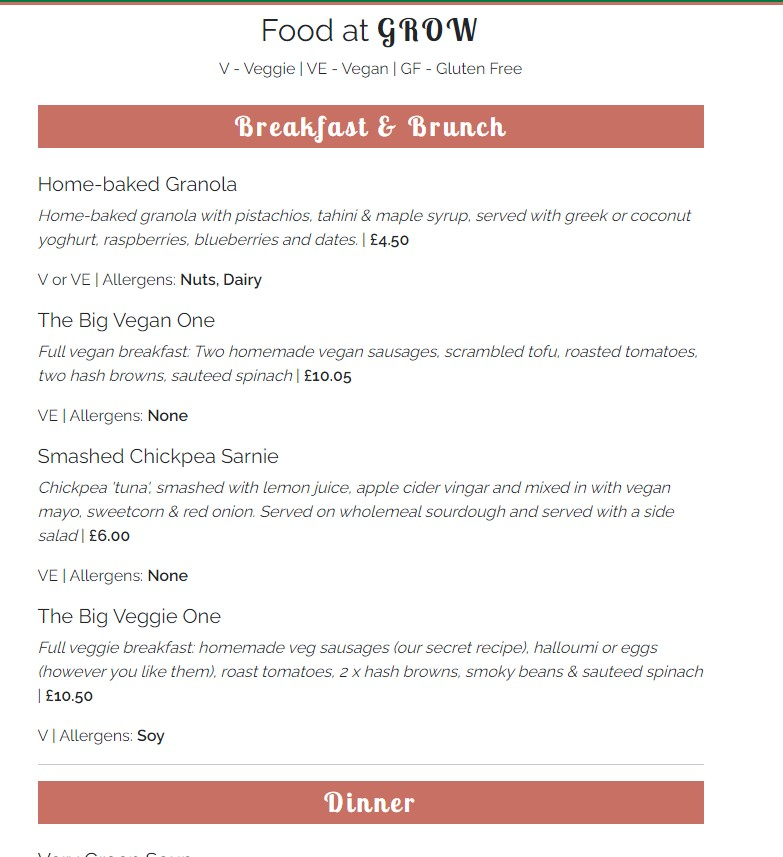
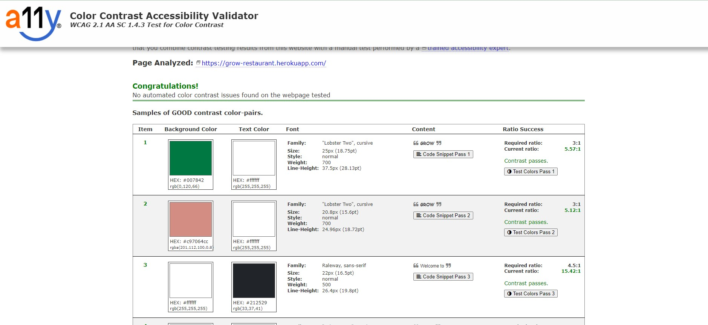

# Grow Restaurant

[Live application can be found here](https://grow-restaurant.herokuapp.com/)

This is a full-stack framework project built using Django, Python, HTML, CSS and JavaScript. This is a restaurant website designed to display menus to customers & allow them to make/edit/delete reservations. This project has been built for educational purposes.

---
## UX

### Strategy
Using the core UX principles I first started with Strategy, thinking about the target audience for this quiz & the features they would want.

The target audience for 'Grow' is:
- 25-35 year olds
- People that live a healthy, balanced lifestyle
- People that enjoy eating out

These users will be looking for:
- Informative website, with information that is easy-to-find & concise
- Current, up-to-date menus
- A booking form to make reservation enquiries with the restaurant

This website will offer all of these things whilst also allowing for intuitive navigation and comfortability of use. 

Due to the age group of the users, it is assumed that most users will be viewing the site on their mobile phones and therefore creating something responsive is integral to the design, I have used Bootstrap elements & custom CSS to allow for this.

## User Stories
Please find all my defined user stories & their acceptance criteria [here](https://github.com/daisygunn/grow-restaurant/issues)

1. As a user I can intuitively navigate through the site so that I can view desired content.
2. As a user I can get key information about the restaurant from the landing page so that I can spend less time having to search for information.
3. As an admin user I can log in so that I can access the site's backend.
4. As an admin user I can approve or reject any reservation requests so that I can manage the restaurant's bookings efficiently.
5. As an admin user I can sign in to add & remove items from the current menus so that I can make sure the website is up to date and accurately reflects what is being served in the restaurant.
6. As an admin user I can create, remove, update or delete food & drinks items from the database so that I can ensure items are accurate and able to be added to the menu on the website.
7. As a user I can register or log in so that I can manage my booking requests.
8. As a user I can easily see if I'm logged in or not so that I can choose to log in or log out depending on what I'm doing.
9. As a user I can am prompted to register for an account so that I can create an account and receive the benefits from having a profile.
10. As a user I can log in so that I can auto-populate forms with my information on the site.
11. As a user I can view the food & drinks menu's separately so that I can easily find the information I'm looking for.
12. As a user I can easily find all of the relevant information about the menu items so that I can make informed decisions.
13. As a user I can submit a reservation request so that I can visit the restaurant.
14. As an admin user I can prevent guests from submitting reservation requests for full slots so that I can efficiently manage customer expectations and prevent a backlog of bookings.
15. As a user I can find a navigation bar and footer so that I can see what content there is on the website.
16. As a user I can send a contact form to the restaurant so that I can receive additional information.
17. As a logged in customer I can edit/delete an existing enquiry so that I can make changes if required online.
18. As a user I can edit my customer information so that I can make sure my details are up to date for any future communication with the restaurant.

### Scope
In order to achieve the desired user & business goals, the following features will be included in this release:

- Responsive navbar that will navigate to the various pages throughout the site
- Landing page with brief information about the restaurant and links to the menu and reservations page
- Menus page, with links to food & drinks menu respectively
- Reservations page, with a booking form to enquire with the restaurant
- Manage reservations page, where logged in users can edit/delete existing reservations they have.
- Update details page, for logged in users to update their details which in turn updates the customer model. 
- Register/login feature
- Contact form

### Structure
This website has been designed with simplicity in mind, each page only has key information on it so that the user can find what they want quickly without having to read through unnecessary things. I have separated each key feature to highlight its functionality to the user.

The website is made of three apps:

1. Website - core functionality
2. Menus - menu display
3. Reservations - reservations enquiries & customer management

### Databases

The menus and reservations app both require databases to store information so I have built 5 custom models. 

#### Menus
FoodItem & DrinksItem are the model names for the menus app, these are two standalone models that provide all of the information required to display the items as part of the restaurant's menu. Each item has a name, description, price, dietary & allergens. 

#### Reservations
There are 3 models in this app, Customer, Table & Reservation. The combination of these 3 models allow for customer details to be stored, reservation enquiries to be made & managed & also enable availability checks whilst the user is enquiring. 

For each reservation, there will be a customer & table assigned to it. The customer is assigned during the enquiry process and the tables are assigned in the backend by the admin user. 

The tables model is also used to determine what the availability of the restaurant is like and this logic prevents bookings from being made if there are no tables available at the specified date and time.

Entity Relationship Diagram below to see how the models relate to each other: 

### Skeleton
[Wireframes can be viewed here](assets/documents/grow-wireframes.pdf)

Please note the actual website differs slightly from the original wireframes. 

The theme of simplicity follows through to the design, I've used bootstrap columns and rows to divide the pages and tried to keep the same layout throughout so that the user has a sense of ease when on the various pages. 

### Surface
Initially, the colour palette I have chosen for this website are greens and white. I wanted a 'clean' feel and based it on greens to keep in theme with Grow, nature plays a huge role in the design of the restaurant and the menu so I wanted there to be consistency. However, whilst building the website I felt the sole use of green made it feel a little flat and so I chose to add pink to the colour scheme. This change between pink and green features often, on button hover, in the navbar etc. 

I chose the fonts 'Lobster' & 'Raleway', I wanted a bold/statement font to use for headings which is why I chose 'Lobster' and then 'Raleway' for the general content as it's easier to read for the user. 

---
## Features

### Home page
**Navigation bar**: The navigation bar has links to all the active pages for the user and are clearly labelled, the menus option has a dropdown link to take the user to the food or drink menu. The page that the user is on has an 'active' style, the background changes to white and the text turns green to indicate to the user which page they're on. The same style change also happens when a nav link is hovered on to again clearly indicate to the user what they are about to click on. 

If the user is logged in then the right side of the menu shows links for pages that only authorised users can visit & use, they are: 'Manage Reservations', 'Update Details' & 'Logout'. Otherwise, the user will be given the option to 'Register' or 'Login'. This change in the menu ensures users are directed to pages they can use, preventing any frustration and also prompting the user to sign up for an account. Furthermore, it makes it abundantly clear what the logged in status is to the user. 

The navigation bar is fully responsive and collapses on mobile screens to a hamburger icon, this easily allows the user to continue to use the navigation links without the need to press back on the browser. 

**Menus image with link**: This image and title are both clickable and will take the user to the menus page. I have added a CSS rule that flips the image on hover & the title below also changes when it is hovered over, both have been implemented as a fun interaction for the user whilst giving a clear indication where they are on the page.

**Reservations image with link**: This image and title are both clickable and will take the user to the reservations page. I have added a CSS rule that flips the image on hover & the title below also changes when it is hovered over, both have been implemented as a fun interaction for the user whilst giving a clear indication where they are on the page.

**Footer**: The footer displays some of the restaurants key information and has links to social accounts. 

### Menus
**Menus page**: This page explains a little more about the menus in the restaurant, it has a link to each menu: Food or Drinks. These images and links have the same 'animation' on hover as the two on the homepage, creating consistency in the users' interaction with the elements.

**Food & Drinks menus**: Each page displays all sections of the menus separately, each menu item has the Dish/Drink name, dish/drink description, price, dietary information & any allergens. The menus are controlled by the admin user, if 'on menu' is selected in the admin panel then the item will be displayed.

I have chosen to display the menus on different pages so that the user is able to find the information they want as easily as possible, this seperation prevents information overload as the pages aren't full of multiple menus.

 

### Reservations
**Reservation form**: This page consists of the customer & reservation model forms, they are displayed together to appear as one to make it simple for the user.

If the user is logged in and they exist in the customer model then their name & email address are pre-populated, this has been done in an effort to improve their overall experience.

If they are not yet in the customer model then only their email address is added. 

As the form requires the phone number to be entered in the +44 format I have added this placeholder to the phone number input field to try and help the user.

If the user is not logged in at all then the form appears blank:

**Manage Reservations**: Logged in users are able to view the manage reservation page, on this page they are shown any reservation enquiries they have previously made.

The reservation id is displayed at the top of the reservation item so they can be easily identified, the reservation status is also given a coloured background, depending on what the status is to help the user see straight away what the status is.

There are also edit & delete buttons, users are able to edit or delete any existing reservations they have. If the booking was confirmed before editing it will change to 'pending' status. 

**Update customer details**: A logged-in user can also update their phone number or full name that is stored in the customer model, this can be done from the 'Update Details' link in the navbar. This page simply displays the customer form but has the email address blanked out - this is because the email is associated with the user account and so I want the user to change their email  for their account.

There are explanation statements on this page regarding the email address as the user is only able to view reservations made under the users 'primary' email. I added this statement so that users were not surprised if they weren't able to view reservations made under an old email address. 

If a user wants to update their email address they can navigate using the link found on 'Update Details'. They are taken to `accounts/email` and from here they can manage the emails associated with their user account. They can also switch their 'Primary' email to view reservations associated with their other email.

### Contact Form
**Contact form**: All users are able to submit a contact form from the 'Contact Us' page, this sends an email to the website owner using Google SMTP. Having a way to communicate with the website owner/restaurant manager is a helpful tool for the user and creates a platform for communication to strengthen the relationships with customers.

This form also pre-populates with the customer's information if they're logged in.

---
## Technologies Used

I have used several technologies that have enabled this design to work:

- [Django](https://www.djangoproject.com/)
    - Django is the framework that has been used to build the over project and it's apps.
- [Python](https://www.python.org/)
    - Python is the core programming language used to write all of the code in this application to make it fully functional.
- [Bootstrap](https://getbootstrap.com/)
    - Used for creating responsive design.
- [Google Fonts](https://fonts.google.com/)
    - Used to obtain the fonts linked in the header, fonts used were Raleway and Lobster
- [Font Awesome](https://fontawesome.com/)
    - Used to obtain the icons used on the high scores and rules pages.
- [Google Developer Tools](https://developers.google.com/web/tools/chrome-devtools)
    - Used as a primary method of fixing spacing issues, finding bugs, and testing responsiveness across the project.
- [GitHub](https://github.com/)
    - Used to store code for the project after being pushed.
- [Git](https://git-scm.com/)
    - Used for version control by utilising the Gitpod terminal to commit to Git and Push to GitHub.
- [Gitpod](https://www.gitpod.io/)
    - Used as the development environment.
- [Heroku](https://dashboard.heroku.com/apps)
    - Used to deploy my application.
- [Lucid](https://lucid.app/documents#/dashboard)
    - Used to create the flowchart for the project.
- [Grammarly](https://www.grammarly.com/)
    - Used to fix the thousands of grammar errors across the project.
- [ImageResizer](https://imageresizer.com/)
    - Used to resize images to reduce loading time.
- [Pep8](http://pep8online.com/)
    - Used to test my code for any issues or errors.
- [AutoPrefixer](https://autoprefixer.github.io/)
    - Used to parse my CSS and ass vendor prefixes.
- [Grammarly](https://www.grammarly.com/)
    - Used to fix the grammar errors across the project.
- [Unicorn Revealer](https://chrome.google.com/webstore/detail/unicorn-revealer/lmlkphhdlngaicolpmaakfmhplagoaln?hl=en-GB)
    - Used to detect overflow of elements, which allowed me to quickly debug any issues.
- [Coloors](https://coolors.co/)
    - Used to create a colour palette for the design.
- [Cloudinary](https://cloudinary.com/)
    - Used to store all of my static files and images.
- [Favicon.io](https://favicon.io/)
    - Used to create favicon's for my website
- [Color Contrast Accessibility Validator](https://color.a11y.com/)
    - Allowed me to test the colour contrast of my webpage.
- [W3C Markup Validation Service](https://validator.w3.org/) 
    - Used to validate all HTML code written and used in this webpage.
- [W3C CSS Validation Service](https://jigsaw.w3.org/css-validator/#validate_by_input)
    - Used to validate all CSS code written and used in this webpage.
- [JSHint](https://jshint.com/)
    - Used to validate JS code
- [Freeformatter CSS Beautify](https://www.freeformatter.com/css-beautifier.html)
    - Used to accurately format my CSS code.
- [Freeformatter HTML Formatter](https://www.freeformatter.com/html-formatter.html)
    - Used to accurately format my HTML code.
- [AmIResponsive](http://ami.responsivedesign.is/)
    - Used to generate responsive image used in README file.
- [Wave](https://wave.webaim.org/)
    - Used to test the accessibility of the website.
- [Animate](https://animate.style/)
    - Used to animate main heading and forms. 
---
## Testing
I have used a combination of manual and automated testing to ensure the website's functionality meets the desired intent.

### Code Validation
All of my code has been validated using an online validator specific to the language, all code now passes with zero errors. 

- [W3C Markup Validation Service](https://validator.w3.org/) 
    - Used to validate all HTML code written and used in this webpage.

- [W3C CSS Validation Service](https://jigsaw.w3.org/css-validator/#validate_by_input)
    - Used to validate all CSS code written and used in this webpage.

- [JSHint](https://jshint.com/)
    - Used to validate JS code

- [Pep8](http://pep8online.com/)
    - Used to test my code for any issues or errors.

In addition to this I have also used online validators to test the accessbility of my website:
- [Wave](https://wave.webaim.org/)
    - Used to test the accessibility of the website.

My initial wave report had multiple contrast errors and so I had to alter my design, the pink used for active/hover nav links were changed to white and I enlarged the font size in my footer. However, one contrast error is still showing in the footer. I am unable to find the reason for this error and have chosen to leave the element as it is, the reason for this is due to the fact it is visually the same as the other elements surrounding it and they do not have a contrast error. 

- [Color Contrast Accessibility Validator](https://color.a11y.com/)
    - Allowed me to test the colour contrast of my webpage.

### Manual Testing

[TESTING.md](TESTING.md)

### Automated Testing
I have used the Coverage library throughout testing to keep track of how much of my code was covered by the tests I had written.

To generate your own coverage report from the command line:

1. Install the package using `pip3 install coverage`
2. Run `coverage run manage.py test`
3. Then `coverage html` to generate the report
4. You can view the report in a browser by opening the `index.html` file from inside the `htmlcov` folder.

### Bugs and Fixes
 - I noticed that upon submitting the reservation form the month was always saved as January (01) no matter what date the user had selected. To fix this I stopped using 'cleaned-data' to retrieve the information from the post request and reformatted the date myself using `strptime`.

 - After deploying my project to Heroku I had an issue with my header, the background image wasn't loading with the file path `assets/images/header-background.jpg`, after discussing the issue with others we concluded that due to me linking an image within the static directory in my css file (that was also in the static directory) this is what was causing the problem. For that reason I have linked directly the Cloudinary image url. 

---
## Deployment

The master branch of this repository has been used for the deployed version of this application.

### Using Github & Gitpod

To deploy my Django application, I had to use the [Code Institute Python Essentials Template](https://github.com/Code-Institute-Org/python-essentials-template).

- Click the `Use This Template` button.
- Add a repository name and brief description.
- Click the `Create Repository from Template` to create your repository.
- To create a Gitpod workspace you then need to click `Gitpod`, this can take a few minutes.
- When you want to work on the project it is best to open the workspace from Gitpod (rather than Github) as this will open your previous workspace rather than creating a new one. You should pin the workspace so that it isn't deleted.
-  Committing your work should be done often and should have clear/explanatory messages, use the following commands to make your commits:
    - `git add .`: adds all modified files to a staging area
    - `git commit -m "A message explaining your commit"`: commits all changes to a local repository.
    - `git push`: pushes all your committed changes to your Github repository.

*Forking the GitHub Repository*

If you want to make changes to your repository without affecting it, you can make a copy of it by 'Forking' it. This ensures your original repository remains unchanged.

1. Find the relevant GitHub repository
2. In the top right corner of the page, click the Fork button (under your account)
3. Your repository has now been 'Forked' and you have a copy to work on

*Cloning the GitHub Repository*

Cloning your repository will allow you to download a local version of the repository to be worked on. Cloning can also be a great way to backup your work.

1. Find the relevant GitHub repository
2. Press the arrow on the Code button
3. Copy the link that is shown in the drop-down
4. Now open Gitpod & select the directory location where you would like the clone created
5. In the terminal type 'git clone' & then paste the link you copied in GitHub
6. Press enter and your local clone will be created.

### Creating an Application with Heroku

I followed the below steps using the Code Institute tutorial and [Django Blog cheatsheat](https://codeinstitute.s3.amazonaws.com/fst/Django%20Blog%20Cheat%20Sheet%20v1.pdf)

- The following command in the Gitpod CLI will create the relevant files needed for Heroku to install your project dependencies `pip3 freeze --local > requirements.txt`. Please note this file should be added to a .gitignore file to prevent the file from being committed.

1. Go to [Heroku.com](https://dashboard.heroku.com/apps) and log in; if you do not already have an account then you will need to create one.
2. Click the `New` dropdown and select `Create New App`.
3. Enter a name for your new project, all Heroku apps need to have a unique name, you will be prompted if you need to change it.
4. Select the region you are working in.

*Heroku Settings*
You will need to set your Environment Variables - this is a key step to ensuring your application is deployed properly.
- In the Settings tab, click on `Reveal Config Vars` and set the following variables:
    - SECRET_KEY - to be set to your chosen key
    - CLOUDINARY_URL - to be set to your Cloudinary API environment variable
- In the resources tab you must install 'Heroku Postgres'

*Heroku Deployment*
In the Deploy tab:
1. Connect your Heroku account to your Github Repository following these steps:
    1. Click on the `Deploy` tab and choose `Github-Connect to Github`.
    2. Enter the GitHub repository name and click on `Search`.
    3. Choose the correct repository for your application and click on `Connect`.
2. You can then choose to deploy the project manually or automatically, automatic deployment will generate a new application every time you push a change to Github, whereas manual deployment requires you to push the `Deploy Branch` button whenever you want a change made.
3. Once you have chosen your deployment method and have clicked `Deploy Branch` your application will be built and you should see the below `View` button, click this to open your application:

---
## Credits

Throughout the process of building this website, I have used various sources online to help me fix bugs & tackle problems. 

[Full-width pic header](https://startbootstrap.com/template/full-width-pics)

[Navbar](https://getbootstrap.com/docs/5.0/components/navbar/)

[To display multiple queryset](https://stackoverflow.com/questions/48872380/display-multiple-queryset-in-list-view)

[Django phone number](https://github.com/stefanfoulis/django-phonenumber-field)

[Gmail SMTP](https://medium.com/@_christopher/how-to-send-emails-with-python-django-through-google-smtp-server-for-free-22ea6ea0fb8e)

[Updating form](https://stackoverflow.com/questions/42217334/django-get-data-and-edit-in-the-same-form-edit-in-one-place)

[Debounce](https://davidwalsh.name/javascript-debounce-function)

[Animate](https://animate.style/)

[Testing](https://www.youtube.com/watch?v=0MrgsYswT1c)

[Unsplash for images](https://unsplash.com/@daisygunn94/likes)

[404 page template](https://colorlib.com/wp/template/colorlib-error-404-15/)

---
## Acknowledgements

I would like to thank my course mentor Guido Cecilio for his support and guidance throughout the course of the project and my peers Harry Dhillon, Deanna Carina and Jack Crosbie for their support & feedback.

---