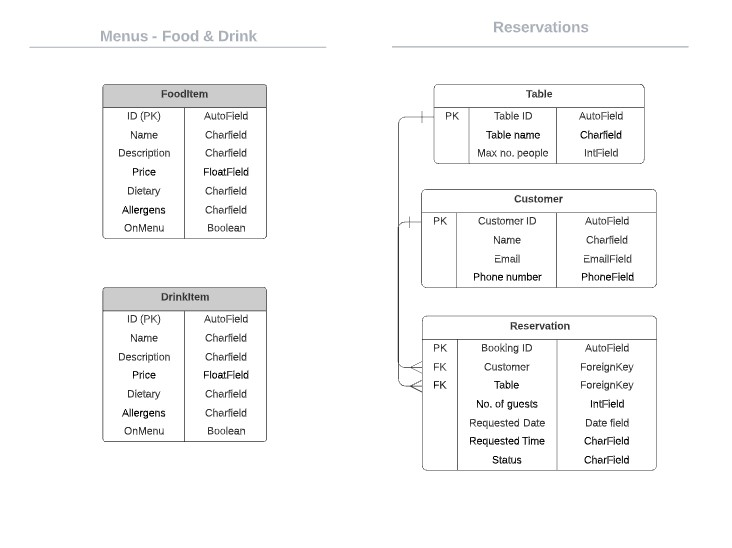

# Grow Restaurant

[Live application can be found here](https://grow-restaurant.herokuapp.com/)

This is a full-stack frameworks project built using Django, Python, HTML, CSS and JavaScript. This is a restaurant website designed to display menus to customers & allow them to make reservations. This project has been built for educational purpose.

---
## UX

### Strategy
Using the core UX principles I first started with Strategy, thinking about the target audience for this quiz & the features they would want.

The target audience for 'Grow' are:
- 25-35 year olds
- People that live a healthy, balanced lifestyle
- People that enjoy eating out

These user will be looking for:
- Informative website, with information that is easy-to-find & concise
- Current, up-to-date menus
- A booking form to make reservation enquiries with the restaurant

This website will offer all of these things whilst also allowing for intuitive navigation and comfortability of use. 

Due to the age group of the users, it is assumed that most users will be viewing the site on their mobile phones and therefore creating something responsive is integral to the design, I have used Bootstrap elements & custom CSS to allow for this.

### Scope
In order to acheuve the desired user & business goals the following features will be included in this release:

- Responsive navbar that will navigate to the various pages throughout the site
- Landing page with brief information about the restaurant and links to the menu and reservations page
- Menus page, with links to food & drinks menu respectively
- Reservations page, with booking form to enquire with the restaurant
- Register/login feature
- Contact form

### Structure
This website has been designed with simplicity in mind, each page only have entirely relevant information on it so that the user is able to find what they want quickly without having to read through unnessecary things. I have seperated out each key feature to really highlight their functionality to the user.

### Skeleton
[Wireframes can be viewed here](assets/documents/grow-wireframes.pdf)

The theme of simplicity follows through to the design, I've used bootstrap columns and rows to divide the pages and tried to keep the same layout throughout so that the user has a sense of ease when on the various pages. 

### Surface
The colour pallete I have chosen for this website are greens and white. I wanted a 'clean' feel and based it on greens to keep in theme with Grow, nature plays a huge role in the design of the restaurant and the menu so I wanted there to be consistency. 

I chose the fonts 'Abril Fatface' & 'Raleway', I wanted a bold/statement font to use for headings which is why I chose 'Abril' and then 'Raleway' for the general content as it's easier to read for the user. 

---
## Features

### Home page
- **Navigation bar**: The navigation bar has links to all the active pages for the user and are clearly labelled, the menus option has a dropdown link to take the user to the food or drink menu. If the user is logged in then 'Logout' will appear otehrwsie the user will be given the option to 'Register' or 'Login'/ 
- **Menus image with link**: This image is clickable and will take the user to the menus page.
- **Reservations image with link**: This image is clickable and will take the user to the reservations page.
- **Footer**: The footer displays some of the restaurants key information and has links to social accounts. 

### Menus - Food & Drinks
- **Seperate menus**: Each page displays all sections of the menus seperately, each menu item has the Dish/Drink name, dish/drink description, price, dietary information & any allergens. 

### Reservations
- **Reservation form**: This page consists of the customer & reservation model forms, they are displayed together to appear as one. If the user is logged in then their name & email address are pre-populated.
- **Manage Reservations**: Logged in users are able to view, edit & delete any existing reservations they have. If the booking was confirmed before editing it will change to pending status. 
- **Update customer details**: A logged in user can also update their phone number or full name that are stored in the customer model. 

### Contact Form
- **Contact form**: All users are able to submit a contact form, which sends an email to the website owner using Google SMTP. 

---
## Technologies Used

I have used several technologies that have enabled this design to work:

- [Django](https://www.djangoproject.com/)
    - Django is the framework that has been used to build the over project and it's apps.
- [Python](https://www.python.org/)
    - Python is the core programming language used to write all of the code in this application to make it fully functional.
- [Bootstrap](https://getbootstrap.com/)
    - Used for creating responsive design.
- [Google Fonts](https://fonts.google.com/)
    - Used to obtain the fonts linked in the header, fonts used were Raleway and Lobster
- [Font Awesome](https://fontawesome.com/)
    - Used to obtain the icons used on the high scores and rules pages.
- [Google Developer Tools](https://developers.google.com/web/tools/chrome-devtools)
    - Used as a primary method of fixing spacing issues, finding bugs, and testing responsiveness across the project.
- [GitHub](https://github.com/)
    - Used to store code for the project after being pushed.
- [Git](https://git-scm.com/)
    - Used for version control by utilising the Gitpod terminal to commit to Git and Push to GitHub.
- [Gitpod](https://www.gitpod.io/)
    - Used as the development environment.
- [Heroku](https://dashboard.heroku.com/apps)
    - Used to deploy my application.
- [Lucid](https://lucid.app/documents#/dashboard)
    - Used to create the flowchart for the project.
- [Grammarly](https://www.grammarly.com/)
    - Used to fix the thousands of grammar errors across the project.
- [ImageResizer](https://imageresizer.com/)
    - Used to resize images to reduce loading time.
- [Pep8](http://pep8online.com/)
    - Used to test my code for any issues or errors.
- [AutoPrefixer](https://autoprefixer.github.io/)
    - Used to parse my CSS and ass vendor prefixes.
- [Grammarly](https://www.grammarly.com/)
    - Used to fix the grammar errors across the project.
- [Unicorn Revealer](https://chrome.google.com/webstore/detail/unicorn-revealer/lmlkphhdlngaicolpmaakfmhplagoaln?hl=en-GB)
    - Used to detect overflow of elements, which allowed me to quickly debug any issues.
- [Coloors](https://coolors.co/)
    - Used to create a colour palette for the design.
- [Favicon.io](https://favicon.io/)
    - Used to create favicon's for my website
- [Color Contrast Accessibility Validator](https://color.a11y.com/)
    - Allowed me to test the colour contrast of my webpage.
- [W3C Markup Validation Service](https://validator.w3.org/) 
    - Used to validate all HTML code written and used in this webpage.
- [W3C CSS Validation Service](https://jigsaw.w3.org/css-validator/#validate_by_input)
    - Used to validate all CSS code written and used in this webpage.
- [Freeformatter CSS Beautify](https://www.freeformatter.com/css-beautifier.html)
    - Used to accurately format my CSS code.
- [Freeformatter HTML Formatter](https://www.freeformatter.com/html-formatter.html)
    - Used to accurately format my HTML code.
- [AmIResponsive](http://ami.responsivedesign.is/)
    - Used to generate responsive image used in README file.
- [Wave](https://wave.webaim.org/)
    - Used to test the accessibility of the website.
- [Animate](https://animate.style/)
    - Used to animate main heading and forms. 
## Testing

I have used a combination of manual and automated testing to ensure the websites functionality meets the desired intent.

### User Stories

### Bugs and Fixes

---
## Deployment

The master branch of this repository has been used for the deployed version of this application.

### Using Github & Gitpod

To deploy my django application, I had to use the [Code Institute Python Essentials Template](https://github.com/Code-Institute-Org/python-essentials-template).

- Click the `Use This Template` button.
- Add a repository name and brief description.
- Click the `Create Repository from Template` to create your repository.
- To create a Gitpod workspace you then need to click `Gitpod`, this can take a few minutes.
- When you want to work on the project it is best to open the workspace from Gitpod (rather than Github) as this will open your previous workspace rather than creating a new one. You should pin the workspace so that it isn't deleted.
-  Committing your work should be done often and should have clear/explanatory messages, use the following commands to make your commits:
    - `git add .`: adds all modified files to a staging area
    - `git commit -m "A message explaining your commit"`: commits all changes to a local repository.
    - `git push`: pushes all your committed changes to your Github repository.

*Forking the GitHub Repository*

If you want to make changes to your repository without affecting it, you can make a copy of it by 'Forking' it. This ensures your original repository remains unchanged.

1. Find the relevant GitHub repository
2. In the top right corner of the page, click the Fork button (under your account)
3. Your repository has now been 'Forked' and you have a copy to work on

*Cloning the GitHub Repository*

Cloning your repository will allow you to download a local version of the repository to be worked on. Cloning can also be a great way to backup your work.

1. Find the relevant GitHub repository
2. Press the arrow on the Code button
3. Copy the link that is shown in the drop-down
4. Now open Gitpod & select the directory location where you would like the clone created
5. In the terminal type 'git clone' & then paste the link you copied in GitHub
6. Press enter and your local clone will be created.

### Creating an Application with Heroku

I followed the below steps using the Code Institute tutorial and 

- The following command in the Gitpod CLI will create the relevant files needed for Heroku to install your project dependencies `pip3 freeze --local > requirements.txt`. Please note this file should be added to a .gitignore file to prevent the file from being committed.

1. Go to [Heroku.com](https://dashboard.heroku.com/apps) and log in; if you do not already have an account then you will need to create one.
2. Click the `New` dropdown and select `Create New App`.
3. Enter a name for your new project, all Heroku apps need to have a unique name, you will be prompted if you need to change it.
4. Select the region you are working in.

*Heroku Settings*
You will need to set your Environment Variables - this is a key step to ensuring your application is deployed properly.
- In the Settings tab, click on `Reveal Config Vars` and set the following variables:
    - SECRET_KEY - to be set to your chosen key
    - CLOUDINARY_URL - to be set to your cloudinary API environment varible
- In the resources tab you must install 'Heroku Postgres'

*Heroku Deployment*
In the Deploy tab:
1. Connect your Heroku account to your Github Repository following these steps:
    1. Click on the `Deploy` tab and choose `Github-Connect to Github`.
    2. Enter the GitHub repository name and click on `Search`.
    3. Choose the correct repository for your application and click on `Connect`.
2. You can then choose to deploy the project manually or automatically, automatic deployment will generate a new application every time you push a change to Github, whereas manual deployment requires you to push the `Deploy Branch` button whenever you want a change made.
3. Once you have chosen your deployment method and have clicked `Deploy Branch` your application will be built and you should see the below `View` button, click this to open your application:

---
## Credits

---
## Acknowledgements

I would like to thank my course mentor Guido Cecilio for his support and guidance throughout the course of the project and my peers Harry Dhillon, Deanna Carina and Jack Crosbie for their support & feedback.

---