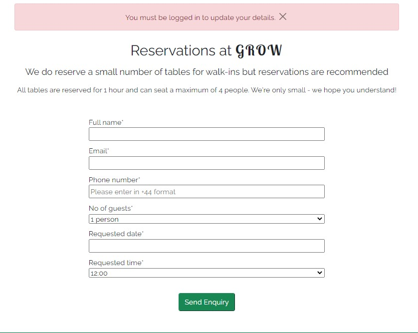

# Manual Testing

[Back to main README](README.md)

## Epic 1 - Core website functionality
### User Stories

1. [Site Navigation](https://github.com/daisygunn/grow-restaurant/issues/1): As a user I can intuitively navigate through the site so that I can view desired content.

2. [Informative Landing Page](https://github.com/daisygunn/grow-restaurant/issues/2): As a user I can get key information about the restaurant from the landing page so that I can spend less time having to search for information.

15. [Basic navbar & footer](https://github.com/daisygunn/grow-restaurant/issues/15): As a user I can find a navigation bar and footer so that I can see what content there is on the website.

The homepage instantly provides the user with all information needed to be able to navigate through the website & to gain an understanding of 'who' the restaurant is.

The navbar is self-explanatory and it is also clear to the user which page they are currently on.

The footer provides all additional key information required, opening times, location and contact information. For users viewing on a larger screen, an embedded google map is included. 

16. [Contact form can be sent](https://github.com/daisygunn/grow-restaurant/issues/16): As a user I can send a contact form to the restaurant so that I can receive additional information.

Upon submitting the contact form a positive message is displayed to the user, to confirm that it has been sent. The website owner receives an email with the information from the form.

## Epic 2 - Admin functionality
### User Stories
3. [Admin Login](https://github.com/daisygunn/grow-restaurant/issues/3): As an admin user I can log in so that I can access the site's backend.
4. [Approve/reject reservation requests](https://github.com/daisygunn/grow-restaurant/issues/4): As an admin user I can approve or reject any reservation requests so that I can manage the restaurant's bookings efficiently.
5. [Menus can be updated](https://github.com/daisygunn/grow-restaurant/issues/5): As an admin user I can sign in to add & remove items from the current menus so that I can make sure the website is up to date and accurately reflects what is being served in the restaurant.
6. [Food and drinks items have CRUD](https://github.com/daisygunn/grow-restaurant/issues/6): As an admin user I can create, remove, update or delete food & drinks items from the database so that I can ensure items are accurate and able to be added to the menu on the website.

Using a specified login the site owner can access the admin backend

Once in this admin backend, the admin user is able to access the food and drinks item model, add new items or edit/delete existing one and toggle with 'on menu' which will change which items are displayed on the 'live' menu pages respectively.

## Epic 3 - User Authentication
### User Stories

7. [Users can login](https://github.com/daisygunn/grow-restaurant/issues/7): As a user I can register or log in so that I can manage my booking requests.
8. [Logged in status clear to user](https://github.com/daisygunn/grow-restaurant/issues/8): As a user I can easily see if I'm logged in or not so that I can choose to log in or log out depending on what I'm doing.
9. [Prompt user to register](https://github.com/daisygunn/grow-restaurant/issues/9): As a user I can am prompted to register for an account so that I can create an account and receive the benefits from having a profile.
10. [Forms pre-populated for users](https://github.com/daisygunn/grow-restaurant/issues/10): As a user I can log in so that I can auto-populate forms with my information on the site.

The navbar displays different nav links depending on the status of the user. If they aren't logged in already the options are `Register` or `Login`.

On the sign-in page the user is prompted to register if they do not have an account:

Once a user logs in they are presented with a success message:

 If they are logged in then this changes, pages that require authentication show instead, these are `Manage Reservations`, `Update Details` & `Logout`.

Logged in users have the benefit of forms pre-populating with their information:

New users will only have their email populated as they will not yet be present in the Customer model.

## Epic 4 - Menus can be viewed
### User Stories
11. [Food and drinks menus displayed seperately](https://github.com/daisygunn/grow-restaurant/issues/11): As a user I can view the food & drinks menu's separately so that I can easily find the information I'm looking for.
12. [All items on the menu have a price, description and dietary info](https://github.com/daisygunn/grow-restaurant/issues/12): As a user I can easily find all of the relevant information about the menu items so that I can make informed decisions.

In the navbar, there is a `Menus` link which has a dropdown to display the two menu options, `Food` & `Drinks`. 

On the `Menus` page there are links to both the Food and Drinks menu pages.

On each of the menu pages, each menu section is separated by a `
` and has a clear heading to highlight these separate sections, making it easier for the user to find what they're looking for. 

For each item, there is a name, description, dietary label, allergens list & price.

## Epic 5 - Reservations Functionality
### User Stories
13. [Users can submit a reservation enquiry](https://github.com/daisygunn/grow-restaurant/issues/13): As a user I can submit a reservation request so that I can visit the restaurant.
14. [Reservation is rejected if restaurant is fully booked](https://github.com/daisygunn/grow-restaurant/issues/14): As an admin user I can prevent guests from submitting reservation requests for full slots so that I can efficiently manage customer expectations and prevent a backlog of bookings.
17. [Reservations can be edited by the user on the front end](https://github.com/daisygunn/grow-restaurant/issues/17): As a logged-in customer I can edit/delete an existing enquiry so that I can make changes if required online.
18. [Users can edit their information](https://github.com/daisygunn/grow-restaurant/issues/18): As a user I can edit my customer information so that I can make sure my details are up to date for any future communication with the restaurant.

From the reservations page, any user (authenticated or not) can add their details, requested time & date and submit the form, if there is availability they will get a positive message.

If there is no availability then they will not be able to submit their request and they will get a message to explain this:

An authenticated user is able to manage any existing reservations from the Manage Reservations page, if they have any they are displayed like this:

From this panel they are able to edit & their reservations:

And users can also cancel them as well:

Users not logged in that try to access these pages are displayed with this message:

A logged in user is able to access the 'Update Details' page where they are displayed with a form pre-filled with their information, here they are able to update their full name and phone number and are guided to the aullauth emails page if they want to change their email.

Users not logged in that try to access this page are redirected and are shown this message:

## JavaScript Tests

I have written a small number of JS functions that handle some animation & event listeners to add classes and attributes to elements created dynamically.

**`screenSize()`** - hides/shows the map section of the footer depending on the size of the window. If smaller than 769 it remains hidden:

And any larger than that it appears:

I have used this function in conjunction with a `debounce` function to prevent the function triggering if being called continuously. It triggers after it has stopped being called for 150 milliseconds. As explained [here](https://davidwalsh.name/javascript-debounce-function)

**`datePicker`** - I opted to use a JQuery datepicker for my project and so this function applies the datepicker to any fields with the id - `"#id_requested_date"`.

**`checkDate`** - This function validates dates being submitted as part of the reservation form, if a date in the past is selected the user is alerted and the form does not submit:

**`formError`** - This function animates the form by adding an Animate class to the form if there is an error. You can see before submitting the only class on the ul is `full-form`:

And after submitting, with an error the class `"animate__animated animate__shakeX"` is added:

**`disableEmail`** - This function has been used to disable the email on the 'Update Details' page as I don't want the user to update it on this page:

This did cause issues when submitting the form as the email field wasn't able to be read so I have used **`removeDisableAttrOnSubmit`** to remove the disabled attribute and then submit the form. 

**`deleteModal`** - This function opens the confirmation modal when a user is trying to cancel an existing reservation and then closes it when the user clicks 'Nope, changed my mind!` or the cross in the top corner.

