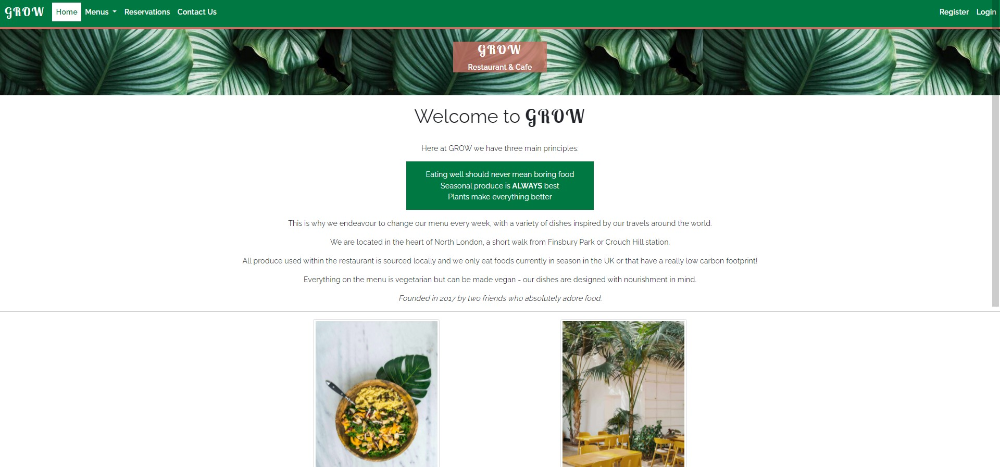
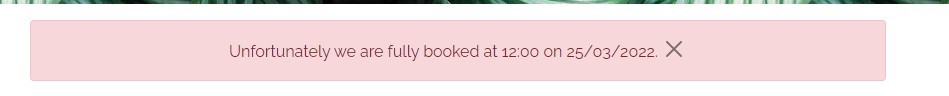
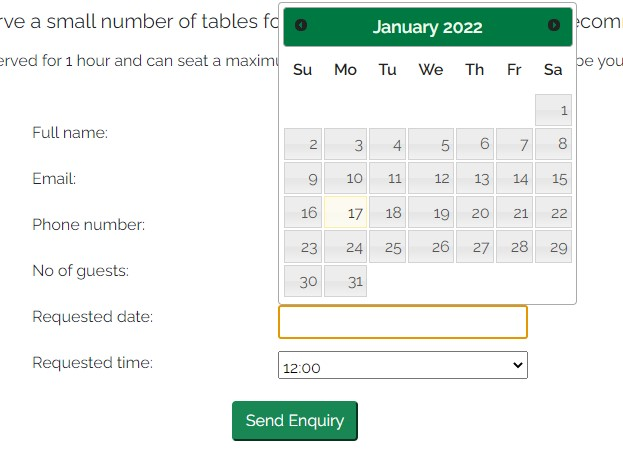

# Manual Testing

## Epic 1 - Core website functionality
### User Stories
[Site Navigation](https://github.com/daisygunn/grow-restaurant/issues/1) / [Basic navbar & footer](https://github.com/daisygunn/grow-restaurant/issues/15) / [Informative Landing Page](https://github.com/daisygunn/grow-restaurant/issues/2) 

The homepage instanlty provides the user with all information needed to be able to navigate through the website & to gain an understanding of 'who' the restaurant is.

The navbar is self explanatory and it is also clear to the user which page they are currently on.

The footer provides all additional key information required, opening times, location and contact information. For users viewing on a larger screen an embedded google map is included. 

[Contact form can be sent](https://github.com/daisygunn/grow-restaurant/issues/16)

Upon submitting the contact form the user is given a postive message to confirm that is has been sent to the website owner and an email is received with the information from the form.

## Epic 2 - Admin functionality
### User Stories
[Admin Login](https://github.com/daisygunn/grow-restaurant/issues/3) / [Menus can be updated](https://github.com/daisygunn/grow-restaurant/issues/5) / [Food and drinks items have CRUD](https://github.com/daisygunn/grow-restaurant/issues/6) /
[Approve/reject reservation requests](https://github.com/daisygunn/grow-restaurant/issues/4)

Using a specified login the site owner can access the admin backend

Once in this admin backend, the admin user is able to access the food and drinks item model, add new items or edit/delete existing one and toggle with 'on menu' which will change which items are displayed on the 'live' menu pages respectively.

## Epic 3 - User Authentication
### User Stories
[Users can login](https://github.com/daisygunn/grow-restaurant/issues/7) /
[Logged in status clear to user](https://github.com/daisygunn/grow-restaurant/issues/8) /
[Prompt user to register](https://github.com/daisygunn/grow-restaurant/issues/9) /
[Forms pre-populated for users](https://github.com/daisygunn/grow-restaurant/issues/10)

The navbar displays different navlinks depending on the status of the user. If they aren't logged in already the options are `Register` or `Login`.

On the sign in page the user is prompted to register if they do not have an account:

Once a user logs in they are presented with a success message:

 If they are logged in then this changes, pages that require authentication show instead, these are `Manage Reservations`, `Update Details` & `Logout`.

Logged in user have the benefit of forms pre-populating with their information:

New users will only have their email populated as they will not yet be present in the Customer model.

## Epic 4 - Menus can be viewed
### User Stories
[Food and drinks menus displayed seperately](https://github.com/daisygunn/grow-restaurant/issues/11) /
[All items on the menu have a price, description and dietary info](https://github.com/daisygunn/grow-restaurant/issues/12) 

In the navbar there is a `Menus` link which has a dropdown to display the two menu options, `Food` & `Drinks`. 

On the `Menus` page there are links to both the Food and Drinks menu pages.

On each of the menu pages each menu section is seperated by a `
` and has a clear heading to highlight these seperate sections, making it easier for the user to find what they're looking for. 

For each item there is a name, description, dietary label, allergens list & price.

## Epic 5 - Reservations Functionality
### User Stories
[Users can submit a reservation enquiry](https://github.com/daisygunn/grow-restaurant/issues/13) /
[Reservation is rejected if restaurant is fully booked](https://github.com/daisygunn/grow-restaurant/issues/14)  / 
[Reservations can be edited by the user on the front end](https://github.com/daisygunn/grow-restaurant/issues/17) / 
[Users can edit their information](https://github.com/daisygunn/grow-restaurant/issues/18)

From the reservations page any user (autheticated or not) can add their details, requested time & date and submit the form, if there is availability they will get a positive message.

If there is no availability then they will not be able to submit their request and they will get a message to explain this:

An authenticated user is able to manage any existing reservations from the Manage Reservations page, if they have any they are displayed like this:

From this panel they are able to edit & their reservations:

And users can also cancel them as well:

## JavaScript Tests

I have written a small number of JS functions that handle some animation & event listeners to add classes and attributes to elements created dynamically.

**`screenSize()`** - hides/shows the map section of the footer depending on the size of the window. If smaller than 769 it remains hidden:

And any larger than that it appears:

I have used this function in conjuction with a `debounce` function to prevent the function being called again and again if being called continuously. It triggers after it has stopped being called for 250 milliseconds. As explained [here](https://davidwalsh.name/javascript-debounce-function)

**`datePicker`** - I opted to use a JQuery datepicker for my project and so this function applies the datepicker to any fields with the id - `"#id_requested_date"`.

**`checkDate`** - This function validates dates being submitted as part of the reservation form, if a date in the past is selected the user is alerted and the form does not submit.

